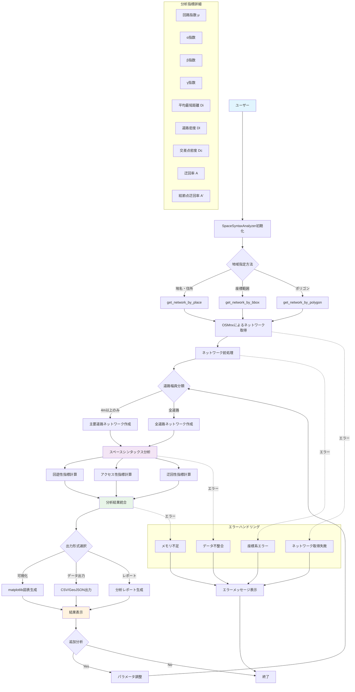

# space-syntax-analyzer 要件定義書

## 1. プロジェクト概要

### 1.1 プロジェクト名

space-syntax-analyzer

### 1.2 目的

スペースシンタックス理論に基づいた都市空間の分析を行う Python ライブラリを開発し、道路ネットワークの空間構造を定量的に分析・可視化する。

### 1.3 背景

従来のスペースシンタックス分析ツールは複雑で使いにくく、日本の都市研究に適用しづらい。OSMnx を活用して道路ネットワークデータを取得し、スペースシンタックス理論の基本指標を計算できるシンプルなライブラリが必要。

## 2. 機能要件

### 2.1 必須機能（第 1 リリース）

#### 2.1.1 道路ネットワーク取得機能

- OSMnx を利用した OpenStreetMap からの道路ネットワークデータ取得
- 地名、住所、座標による地域指定
- 道路幅員による分類（4m 以上/4m 未満）

#### 2.1.2 基本分析指標計算機能

**回遊性指標**

- 回路指数（μ）: e - ν + p
- α 指数: μ / (2ν - 5) × 100
- β 指数: e / ν
- γ 指数: e / 3(ν - 2) × 100

**アクセス性指標**

- 道路結節点の平均最短距離（Ai）
- 道路網全体の平均最短距離（Di）
- 道路密度（Dl）: L / S [m/ha]
- 交差点密度（Dc）: νc / S [n/ha]

**迂回性指標**

- 結節点の迂回率（A'）
- 道路網全体の平均迂回率（A）

#### 2.1.3 基本可視化機能

- 道路ネットワークの可視化
- 分析指標の結果表示（テーブル形式）

#### 2.1.4 データ出力機能

- 分析結果の CSV 出力
- ネットワークデータの GeoJSON 出力

### 2.2 将来拡張機能（今回は対象外）

- 高度な可視化（ヒートマップ、3D 表示）
- 複数地域の比較分析
- 時系列分析
- 歩行者流動分析との統合

## 3. 非機能要件

### 3.1 技術要件

- Python 3.9 以上対応
- PyPI で配布可能な構成
- uv によるパッケージ管理
- タイプヒント完全対応
- 最低限のテストコード実装

### 3.2 依存関係

- networkx: ネットワーク分析
- osmnx: 道路ネットワーク取得
- pandas: データ処理
- numpy: 数値計算
- scipy: 統計計算
- geopandas: 地理空間データ処理
- matplotlib: 基本可視化

### 3.3 パフォーマンス要件

- 中規模都市（1km 四方程度）の分析を 5 分以内で完了
- メモリ使用量は 1GB 以下

### 3.4 使いやすさ要件

- 基本分析を 3 行のコードで実行可能
- 分かりやすい API 設計
- 日本語・英語のドキュメント

## 4. システム構成

### 4.1 パッケージ構造

```
space_syntax_analyzer/
├── __init__.py
├── core/
│   ├── __init__.py
│   ├── network.py           # ネットワーク取得・前処理
│   ├── metrics.py           # 指標計算
│   └── visualization.py     # 可視化
├── utils/
│   ├── __init__.py
│   └── helpers.py           # ユーティリティ関数
└── data/
    └── __init__.py
```

### 4.2 メイン API

```python
# 基本的な使用方法
from space_syntax_analyzer import SpaceSyntaxAnalyzer

analyzer = SpaceSyntaxAnalyzer()
network = analyzer.get_network("Shibuya, Tokyo, Japan")
results = analyzer.analyze(network)
analyzer.visualize(network, results)
```

## 5. 入出力仕様

### 5.1 入力

- 地域指定: 地名、住所、緯度経度、ポリゴン
- 分析パラメータ: 道路幅員閾値、ネットワーク種別

### 5.2 出力

- 分析結果: Dict 形式の指標値
- 可視化: matplotlib 図表
- エクスポート: CSV、GeoJSON

## 6. 品質要件

### 6.1 テスト要件

- 単体テストカバレッジ 70%以上
- 統合テスト実装
- サンプルデータでの動作確認

### 6.2 ドキュメント要件

- README.md（日本語・英語）
- API 仕様書
- 使用例・チュートリアル

## 7. リリース計画

### 7.1 第 1 リリース（v0.1.0）

- 基本機能の実装完了
- PyPI 公開準備完了
- 基本ドキュメント整備

### 7.2 今後のリリース

- v0.2.0: 可視化機能強化
- v0.3.0: 比較分析機能
- v1.0.0: 安定版リリース

## 8. 制約事項

### 8.1 技術的制約

- OpenStreetMap のデータ品質に依存
- ネットワーク規模により処理時間が増大
- インターネット接続が必要

### 8.2 法的制約

- OpenStreetMap のライセンス（ODbL）に準拠
- 商用利用時の制約確認が必要

## 9. リスク分析

### 9.1 技術リスク

- OSMnx API の変更による影響
- メモリ不足による処理失敗
- 座標系変換の精度問題

### 9.2 対策

- 依存関係のバージョン固定
- メモリ使用量の監視機能
- エラーハンドリングの充実

## 9. 画面フロー


